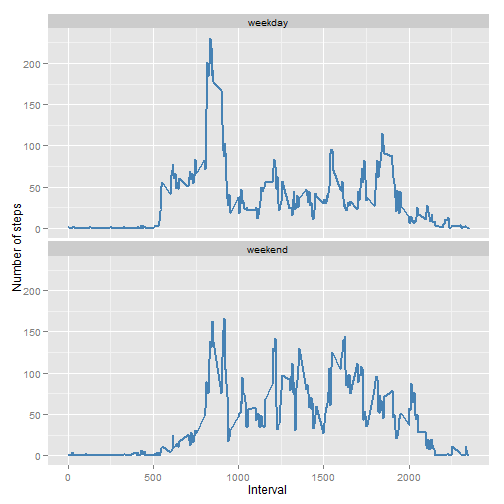

# Reproducible Research: Peer Assessment 1


## Loading and preprocessing the data
1) We check for data directory, if it doesn't exist we create a data directory
2) We then download the file into the data directory
3) Unzip the file into data directory and read the file
4) We convert date field to Date type


```r
library(knitr)
if(!file.exists("./data")){
  dir.create("./data")
  fileUrl <- "https://d396qusza40orc.cloudfront.net/repdata%2Fdata%2Factivity.zip"
  download.file(fileUrl,dest="./data/activity.zip")
  unzip("./data/activity.zip",exdir="./data")
  
  }
activity <- read.csv("./data/activity.csv")
activity$date <- as.Date(activity$date,"%Y-%m-%d")
```

## What is mean total number of steps taken per day?


```r
head(activity)
```

```
##   steps       date interval
## 1    NA 2012-10-01        0
## 2    NA 2012-10-01        5
## 3    NA 2012-10-01       10
## 4    NA 2012-10-01       15
## 5    NA 2012-10-01       20
## 6    NA 2012-10-01       25
```

```r
library(reshape2)
activitymelt <- melt(activity,id=c("date","interval"),na.rm=TRUE)
activitydcast <- dcast(activitymelt,date~variable,sum,na.rm=TRUE)

mean(activitydcast$steps)
```

```
## [1] 10766
```

```r
median(activitydcast$steps)
```

```
## [1] 10765
```

```r
library(ggplot2)

ggplot(activitydcast, aes(x = steps)) + geom_histogram(binwidth=2000) + labs(x = "Number of Steps taken per day", 
        y = "Count") 
```

 


## What is the average daily activity pattern?


```r
activitymelt2 <- melt(activity,id=c("interval","date"),na.rm=TRUE)

activitydcast2 <- dcast(activitymelt2,interval~variable,mean)

head(activitydcast2,n=5)
```

```
##   interval   steps
## 1        0 1.71698
## 2        5 0.33962
## 3       10 0.13208
## 4       15 0.15094
## 5       20 0.07547
```

```r
summary(activitydcast2$steps)
```

```
##    Min. 1st Qu.  Median    Mean 3rd Qu.    Max. 
##    0.00    2.49   34.10   37.40   52.80  206.00
```

```r
activitydcast2$interval[which.max(activitydcast2$steps)]
```

```
## [1] 835
```

```r
ggplot(activitydcast2,aes(x=interval,y=steps))+geom_line()
```

 

## Imputing missing values
To populate missing values, we choose to replace them with the mean value at the same interval across days. The choice is based on the assumption that activities usually follow a daily pattern.


```r
head(is.na(activity))
```

```
##      steps  date interval
## [1,]  TRUE FALSE    FALSE
## [2,]  TRUE FALSE    FALSE
## [3,]  TRUE FALSE    FALSE
## [4,]  TRUE FALSE    FALSE
## [5,]  TRUE FALSE    FALSE
## [6,]  TRUE FALSE    FALSE
```

```r
head(activity[!complete.cases(activity),])
```

```
##   steps       date interval
## 1    NA 2012-10-01        0
## 2    NA 2012-10-01        5
## 3    NA 2012-10-01       10
## 4    NA 2012-10-01       15
## 5    NA 2012-10-01       20
## 6    NA 2012-10-01       25
```

```r
table(complete.cases(activity))
```

```
## 
## FALSE  TRUE 
##  2304 15264
```

```r
table(is.na(activity$steps))
```

```
## 
## FALSE  TRUE 
## 15264  2304
```

```r
missingindexes <- is.na(activity$steps)
missingactivity <- (activity[missingindexes,])
head(activitydcast2)
```

```
##   interval   steps
## 1        0 1.71698
## 2        5 0.33962
## 3       10 0.13208
## 4       15 0.15094
## 5       20 0.07547
## 6       25 2.09434
```

```r
missing_indices <- which(is.na(activity$steps))
missing_steps <- unlist(lapply(missing_indices, FUN = function(idx) {
        interval = activity[idx, ]$interval
        activitydcast2[activitydcast2$interval == interval, ]$steps
    }))
new_steps <- activity$steps
new_steps[missing_indices] <- missing_steps
new_activity <- activity
new_activity$steps <- new_steps

head(activity)
```

```
##   steps       date interval
## 1    NA 2012-10-01        0
## 2    NA 2012-10-01        5
## 3    NA 2012-10-01       10
## 4    NA 2012-10-01       15
## 5    NA 2012-10-01       20
## 6    NA 2012-10-01       25
```

```r
head(new_activity)
```

```
##     steps       date interval
## 1 1.71698 2012-10-01        0
## 2 0.33962 2012-10-01        5
## 3 0.13208 2012-10-01       10
## 4 0.15094 2012-10-01       15
## 5 0.07547 2012-10-01       20
## 6 2.09434 2012-10-01       25
```

```r
new_activitymelt <- melt(new_activity,id=c("date","interval"),na.rm=TRUE)
new_activitydcast <- dcast(new_activitymelt,date~variable,sum,na.rm=TRUE)
mean(new_activitydcast$steps)
```

```
## [1] 10766
```

```r
median(new_activitydcast$steps)
```

```
## [1] 10766
```

```r
ggplot(new_activitydcast, aes(x = steps)) + geom_histogram(binwidth=2000) + labs(x = "Number of Steps taken per day", 
        y = "Count") 
```

 

Comparing with the calculations done in the first section of this document, we observe that while the mean value remains unchanghed, the median value has shifted closer to the mean.


## Are there differences in activity patterns between weekdays and weekends?

We do this comparison with the table with filled-in missing values.

1) Augment the table with a column that indicates the day of the week
2) Subset the table into two parts - weekends (Saturday and Sunday) and weekdays (Monday through Friday).
3) Tabulate the average steps per interval for each dataset.
4) Plot the two datasets side by side for comparison.


```r
str(activity)
```

```
## 'data.frame':	17568 obs. of  3 variables:
##  $ steps   : int  NA NA NA NA NA NA NA NA NA NA ...
##  $ date    : Date, format: "2012-10-01" "2012-10-01" ...
##  $ interval: int  0 5 10 15 20 25 30 35 40 45 ...
```

```r
new_activity$day <- as.factor(weekdays(new_activity$date))
weekend_activity <- subset(new_activity, day %in% c("Saturday", "Sunday"))
weekday_activity <- subset(new_activity, !day %in% c("Saturday", "Sunday"))

head(weekend_activity)
```

```
##      steps       date interval      day
## 1441     0 2012-10-06        0 Saturday
## 1442     0 2012-10-06        5 Saturday
## 1443     0 2012-10-06       10 Saturday
## 1444     0 2012-10-06       15 Saturday
## 1445     0 2012-10-06       20 Saturday
## 1446     0 2012-10-06       25 Saturday
```

```r
head(weekday_activity)
```

```
##     steps       date interval    day
## 1 1.71698 2012-10-01        0 Monday
## 2 0.33962 2012-10-01        5 Monday
## 3 0.13208 2012-10-01       10 Monday
## 4 0.15094 2012-10-01       15 Monday
## 5 0.07547 2012-10-01       20 Monday
## 6 2.09434 2012-10-01       25 Monday
```

```r
str(weekend_activity)
```

```
## 'data.frame':	4608 obs. of  4 variables:
##  $ steps   : num  0 0 0 0 0 0 0 0 0 0 ...
##  $ date    : Date, format: "2012-10-06" "2012-10-06" ...
##  $ interval: int  0 5 10 15 20 25 30 35 40 45 ...
##  $ day     : Factor w/ 7 levels "Friday","Monday",..: 3 3 3 3 3 3 3 3 3 3 ...
```

```r
new <- data.frame(weekend_activity$steps,weekend_activity$interval,weekend_activity$date)
colnames(new) <- c("steps","interval","date")

#weekend_activity$steps <- as.integer(weekend_activity$steps)
#weekend_activity$interval <- as.numeric(weekend_activity$interval)

weekendmelt <- melt(new,id=c("interval","date"),na.rm=TRUE)

head(weekendmelt)
```

```
##   interval       date variable value
## 1        0 2012-10-06    steps     0
## 2        5 2012-10-06    steps     0
## 3       10 2012-10-06    steps     0
## 4       15 2012-10-06    steps     0
## 5       20 2012-10-06    steps     0
## 6       25 2012-10-06    steps     0
```

```r
tail(weekendmelt)
```

```
##      interval       date variable value
## 4603     2330 2012-11-25    steps    17
## 4604     2335 2012-11-25    steps   176
## 4605     2340 2012-11-25    steps    94
## 4606     2345 2012-11-25    steps    26
## 4607     2350 2012-11-25    steps     0
## 4608     2355 2012-11-25    steps     0
```

```r
str(weekendmelt)
```

```
## 'data.frame':	4608 obs. of  4 variables:
##  $ interval: int  0 5 10 15 20 25 30 35 40 45 ...
##  $ date    : Date, format: "2012-10-06" "2012-10-06" ...
##  $ variable: Factor w/ 1 level "steps": 1 1 1 1 1 1 1 1 1 1 ...
##  $ value   : num  0 0 0 0 0 0 0 0 0 0 ...
```

```r
weekendactivitydcast <- dcast(weekendmelt,interval~variable,mean,na.rm=TRUE)
head(weekendactivitydcast)
```

```
##   interval    steps
## 1        0 0.214623
## 2        5 0.042453
## 3       10 0.016509
## 4       15 0.018868
## 5       20 0.009434
## 6       25 3.511792
```

```r
newweekday <- data.frame(weekday_activity$steps,weekday_activity$interval,weekday_activity$date)
colnames(newweekday) <- c("steps","interval","date")

weekdaymelt <- melt(newweekday,id=c("interval","date"),na.rm=TRUE)

head(weekdaymelt)
```

```
##   interval       date variable   value
## 1        0 2012-10-01    steps 1.71698
## 2        5 2012-10-01    steps 0.33962
## 3       10 2012-10-01    steps 0.13208
## 4       15 2012-10-01    steps 0.15094
## 5       20 2012-10-01    steps 0.07547
## 6       25 2012-10-01    steps 2.09434
```

```r
tail(weekdaymelt)
```

```
##       interval       date variable  value
## 12955     2330 2012-11-30    steps 2.6038
## 12956     2335 2012-11-30    steps 4.6981
## 12957     2340 2012-11-30    steps 3.3019
## 12958     2345 2012-11-30    steps 0.6415
## 12959     2350 2012-11-30    steps 0.2264
## 12960     2355 2012-11-30    steps 1.0755
```

```r
str(weekdaymelt)
```

```
## 'data.frame':	12960 obs. of  4 variables:
##  $ interval: int  0 5 10 15 20 25 30 35 40 45 ...
##  $ date    : Date, format: "2012-10-01" "2012-10-01" ...
##  $ variable: Factor w/ 1 level "steps": 1 1 1 1 1 1 1 1 1 1 ...
##  $ value   : num  1.717 0.3396 0.1321 0.1509 0.0755 ...
```

```r
weekdayactivitydcast <- dcast(weekdaymelt,interval~variable,mean,na.rm=TRUE)
head(weekdayactivitydcast)
```

```
##   interval   steps
## 1        0 2.25115
## 2        5 0.44528
## 3       10 0.17317
## 4       15 0.19790
## 5       20 0.09895
## 6       25 1.59036
```

```r
weekdayactivitydcast$dayofweek <- "weekday"
weekendactivitydcast$dayofweek <- "weekend"


day_of_week_data <- rbind(weekdayactivitydcast, weekendactivitydcast)
day_of_week_data$dayofweek <- as.factor(day_of_week_data$dayofweek)

head(day_of_week_data)
```

```
##   interval   steps dayofweek
## 1        0 2.25115   weekday
## 2        5 0.44528   weekday
## 3       10 0.17317   weekday
## 4       15 0.19790   weekday
## 5       20 0.09895   weekday
## 6       25 1.59036   weekday
```

```r
tail(day_of_week_data)
```

```
##     interval   steps dayofweek
## 571     2330  1.3880   weekend
## 572     2335 11.5873   weekend
## 573     2340  6.2877   weekend
## 574     2345  1.7052   weekend
## 575     2350  0.0283   weekend
## 576     2355  0.1344   weekend
```

```r
plot_day_of_week_comparison <- function(dow_data) {
    ggplot(dow_data, aes(x = interval, y = steps)) + geom_line(color = "steelblue", 
        size = 1) + facet_wrap(~dayofweek, nrow = 2, ncol = 1) + labs(x = "Interval", 
        y = "Number of steps")
}

plot_day_of_week_comparison(day_of_week_data)
```

 
