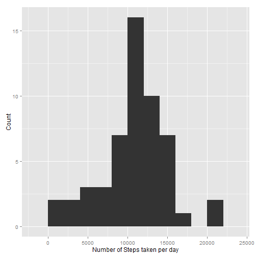
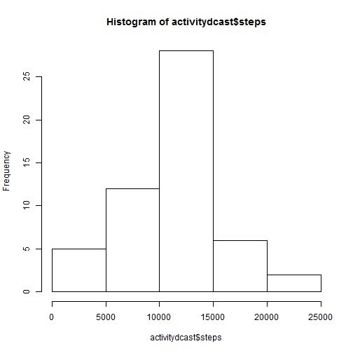
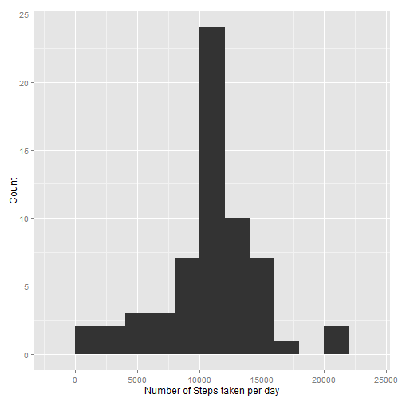

# Reproducible Research: Peer Assessment 1


## Loading and preprocessing the data
1) We check for data directory, if it doesn't exist we create a data directory
2) We then download the file into the data directory
3) Unzip the file into data directory and read the file
4) We convert date field to Date type


```r
library(knitr)
if(!file.exists("./data")){
  dir.create("./data")
  fileUrl <- "https://d396qusza40orc.cloudfront.net/repdata%2Fdata%2Factivity.zip"
  download.file(fileUrl,dest="./data/activity.zip")
  unzip("./data/activity.zip",exdir="./data")
  
  }
activity <- read.csv("./data/activity.csv")
activity$date <- as.Date(activity$date,"%Y-%m-%d")
```

## What is mean total number of steps taken per day?


```r
head(activity)
```

```
##   steps       date interval
## 1    NA 2012-10-01        0
## 2    NA 2012-10-01        5
## 3    NA 2012-10-01       10
## 4    NA 2012-10-01       15
## 5    NA 2012-10-01       20
## 6    NA 2012-10-01       25
```

```r
library(reshape2)
activitymelt <- melt(activity,id=c("date","interval"),na.rm=TRUE)
activitydcast <- dcast(activitymelt,date~variable,sum,na.rm=TRUE)
mean(activitydcast$steps)
```

```
## [1] 10766
```

```r
median(activitydcast$steps)
```

```
## [1] 10765
```

```r
library(ggplot2)

ggplot(activitydcast, aes(x = steps)) + geom_histogram(binwidth=2000) + labs(x = "Number of Steps taken per day", 
        y = "Count") 
```

 


## What is the average daily activity pattern?


```r
activitymelt2 <- melt(activity,id=c("interval","date"),na.rm=TRUE)

activitydcast2 <- dcast(activitymelt2,interval~variable,mean)

head(activitydcast2,n=5)
```

```
##   interval   steps
## 1        0 1.71698
## 2        5 0.33962
## 3       10 0.13208
## 4       15 0.15094
## 5       20 0.07547
```

```r
summary(activitydcast2$steps)
```

```
##    Min. 1st Qu.  Median    Mean 3rd Qu.    Max. 
##    0.00    2.49   34.10   37.40   52.80  206.00
```

```r
activitydcast2$interval[which.max(activitydcast2$steps)]
```

```
## [1] 835
```

```r
ggplot(activitydcast2,aes(x=interval,y=steps))+geom_line()
```

 

## Imputing missing values


```r
head(is.na(activity))
```

```
##      steps  date interval
## [1,]  TRUE FALSE    FALSE
## [2,]  TRUE FALSE    FALSE
## [3,]  TRUE FALSE    FALSE
## [4,]  TRUE FALSE    FALSE
## [5,]  TRUE FALSE    FALSE
## [6,]  TRUE FALSE    FALSE
```

```r
head(activity[!complete.cases(activity),])
```

```
##   steps       date interval
## 1    NA 2012-10-01        0
## 2    NA 2012-10-01        5
## 3    NA 2012-10-01       10
## 4    NA 2012-10-01       15
## 5    NA 2012-10-01       20
## 6    NA 2012-10-01       25
```

```r
table(complete.cases(activity))
```

```
## 
## FALSE  TRUE 
##  2304 15264
```

```r
table(is.na(activity$steps))
```

```
## 
## FALSE  TRUE 
## 15264  2304
```

```r
missingindexes <- is.na(activity$steps)
missingactivity <- (activity[missingindexes,])
head(activitydcast2)
```

```
##   interval   steps
## 1        0 1.71698
## 2        5 0.33962
## 3       10 0.13208
## 4       15 0.15094
## 5       20 0.07547
## 6       25 2.09434
```

```r
missing_indices <- which(is.na(activity$steps))
missing_steps <- unlist(lapply(missing_indices, FUN = function(idx) {
        interval = activity[idx, ]$interval
        activitydcast2[activitydcast2$interval == interval, ]$steps
    }))
new_steps <- activity$steps
new_steps[missing_indices] <- missing_steps
new_activity <- activity
new_activity$steps <- new_steps

head(activity)
```

```
##   steps       date interval
## 1    NA 2012-10-01        0
## 2    NA 2012-10-01        5
## 3    NA 2012-10-01       10
## 4    NA 2012-10-01       15
## 5    NA 2012-10-01       20
## 6    NA 2012-10-01       25
```

```r
head(new_activity)
```

```
##     steps       date interval
## 1 1.71698 2012-10-01        0
## 2 0.33962 2012-10-01        5
## 3 0.13208 2012-10-01       10
## 4 0.15094 2012-10-01       15
## 5 0.07547 2012-10-01       20
## 6 2.09434 2012-10-01       25
```

```r
new_activitymelt <- melt(new_activity,id=c("date","interval"),na.rm=TRUE)
new_activitydcast <- dcast(new_activitymelt,date~variable,sum,na.rm=TRUE)
mean(new_activitydcast$steps)
```

```
## [1] 10766
```

```r
median(new_activitydcast$steps)
```

```
## [1] 10766
```

```r
ggplot(new_activitydcast, aes(x = steps)) + geom_histogram(binwidth=2000) + labs(x = "Number of Steps taken per day", 
        y = "Count") 
```

 


## Are there differences in activity patterns between weekdays and weekends?

We do this comparison with the table with filled-in missing values.

1) Augment the table with a column that indicates the day of the week
2) Subset the table into two parts - weekends (Saturday and Sunday) and weekdays (Monday through Friday).
3) Tabulate the average steps per interval for each dataset.
4) Plot the two datasets side by side for comparison.


```r
str(activity)
```

```
## 'data.frame':	17568 obs. of  3 variables:
##  $ steps   : int  NA NA NA NA NA NA NA NA NA NA ...
##  $ date    : Date, format: "2012-10-01" "2012-10-01" ...
##  $ interval: int  0 5 10 15 20 25 30 35 40 45 ...
```

```r
new_activity$day <- as.factor(weekdays(new_activity$date))
weekend_activity <- subset(new_activity, day %in% c("Saturday", "Sunday"))
weekday_activity <- subset(new_activity, !day %in% c("Saturday", "Sunday"))

head(weekend_activity)
```

```
##      steps       date interval      day
## 1441     0 2012-10-06        0 Saturday
## 1442     0 2012-10-06        5 Saturday
## 1443     0 2012-10-06       10 Saturday
## 1444     0 2012-10-06       15 Saturday
## 1445     0 2012-10-06       20 Saturday
## 1446     0 2012-10-06       25 Saturday
```

```r
head(weekday_activity)
```

```
##     steps       date interval    day
## 1 1.71698 2012-10-01        0 Monday
## 2 0.33962 2012-10-01        5 Monday
## 3 0.13208 2012-10-01       10 Monday
## 4 0.15094 2012-10-01       15 Monday
## 5 0.07547 2012-10-01       20 Monday
## 6 2.09434 2012-10-01       25 Monday
```

```r
str(weekend_activity)
```

```
## 'data.frame':	4608 obs. of  4 variables:
##  $ steps   : num  0 0 0 0 0 0 0 0 0 0 ...
##  $ date    : Date, format: "2012-10-06" "2012-10-06" ...
##  $ interval: int  0 5 10 15 20 25 30 35 40 45 ...
##  $ day     : Factor w/ 7 levels "Friday","Monday",..: 3 3 3 3 3 3 3 3 3 3 ...
```

```r
new <- data.frame(weekend_activity$steps,weekend_activity$interval,weekend_activity$date)
colnames(new) <- c("steps","interval","date")

#weekend_activity$steps <- as.integer(weekend_activity$steps)
#weekend_activity$interval <- as.numeric(weekend_activity$interval)

weekendmelt <- melt(new,id=c("interval","date"),na.rm=TRUE)

head(weekendmelt)
```

```
##   interval       date variable value
## 1        0 2012-10-06    steps     0
## 2        5 2012-10-06    steps     0
## 3       10 2012-10-06    steps     0
## 4       15 2012-10-06    steps     0
## 5       20 2012-10-06    steps     0
## 6       25 2012-10-06    steps     0
```

```r
tail(weekendmelt)
```

```
##      interval       date variable value
## 4603     2330 2012-11-25    steps    17
## 4604     2335 2012-11-25    steps   176
## 4605     2340 2012-11-25    steps    94
## 4606     2345 2012-11-25    steps    26
## 4607     2350 2012-11-25    steps     0
## 4608     2355 2012-11-25    steps     0
```

```r
str(weekendmelt)
```

```
## 'data.frame':	4608 obs. of  4 variables:
##  $ interval: int  0 5 10 15 20 25 30 35 40 45 ...
##  $ date    : Date, format: "2012-10-06" "2012-10-06" ...
##  $ variable: Factor w/ 1 level "steps": 1 1 1 1 1 1 1 1 1 1 ...
##  $ value   : num  0 0 0 0 0 0 0 0 0 0 ...
```

```r
weekendactivitydcast <- dcast(weekendmelt,interval~variable,mean,na.rm=TRUE)
head(weekendactivitydcast)
```

```
##   interval    steps
## 1        0 0.214623
## 2        5 0.042453
## 3       10 0.016509
## 4       15 0.018868
## 5       20 0.009434
## 6       25 3.511792
```

```r
newweekday <- data.frame(weekday_activity$steps,weekday_activity$interval,weekday_activity$date)
colnames(newweekday) <- c("steps","interval","date")

weekdaymelt <- melt(newweekday,id=c("interval","date"),na.rm=TRUE)

head(weekdaymelt)
```

```
##   interval       date variable   value
## 1        0 2012-10-01    steps 1.71698
## 2        5 2012-10-01    steps 0.33962
## 3       10 2012-10-01    steps 0.13208
## 4       15 2012-10-01    steps 0.15094
## 5       20 2012-10-01    steps 0.07547
## 6       25 2012-10-01    steps 2.09434
```

```r
tail(weekdaymelt)
```

```
##       interval       date variable  value
## 12955     2330 2012-11-30    steps 2.6038
## 12956     2335 2012-11-30    steps 4.6981
## 12957     2340 2012-11-30    steps 3.3019
## 12958     2345 2012-11-30    steps 0.6415
## 12959     2350 2012-11-30    steps 0.2264
## 12960     2355 2012-11-30    steps 1.0755
```

```r
str(weekdaymelt)
```

```
## 'data.frame':	12960 obs. of  4 variables:
##  $ interval: int  0 5 10 15 20 25 30 35 40 45 ...
##  $ date    : Date, format: "2012-10-01" "2012-10-01" ...
##  $ variable: Factor w/ 1 level "steps": 1 1 1 1 1 1 1 1 1 1 ...
##  $ value   : num  1.717 0.3396 0.1321 0.1509 0.0755 ...
```

```r
weekdayactivitydcast <- dcast(weekdaymelt,interval~variable,mean,na.rm=TRUE)
head(weekdayactivitydcast)
```

```
##   interval   steps
## 1        0 2.25115
## 2        5 0.44528
## 3       10 0.17317
## 4       15 0.19790
## 5       20 0.09895
## 6       25 1.59036
```

```r
weekend_spi <- weekendactivitydcast$steps
weekday_spi <- weekdayactivitydcast$steps
head(weekend_spi)
```

```
## [1] 0.214623 0.042453 0.016509 0.018868 0.009434 3.511792
```

```r
weekend_spi$dayofweek <- rep("weekend", NROW(weekend_spi))
```

```
## Warning: Coercing LHS to a list
```

```r
weekday_spi$dayofweek <- rep("weekday", NROW(weekday_spi))
```

```
## Warning: Coercing LHS to a list
```

```r
day_of_week_data <- rbind(weekend_spi, weekday_spi)
day_of_week_data <- data.frame(day_of_week_data)

day_of_week_data$dayofweek <- as.factor(day_of_week_data$dayofweek)
```

```
## Error: 'x' must be atomic for 'sort.list'
## Have you called 'sort' on a list?
```

```r
data.frame(day_of_week_data)
```

```
##                 V1      V2      V3      V4       V5    V6      V7     V8
## weekend_spi 0.2146 0.04245 0.01651 0.01887 0.009434 3.512 0.06604 0.1085
## weekday_spi  2.251  0.4453  0.1732  0.1979  0.09895  1.59  0.6927  1.138
##             V9   V10     V11     V12     V13     V14     V15     V16 V17
## weekend_spi  0 0.559 0.03774   0.454 0.04009   2.335 0.01887 0.04245   0
## weekday_spi  0 1.796  0.3958 0.01761  0.4205 0.09057  0.1979  0.4453   0
##                V18    V19     V20     V21    V22     V23 V24 V25 V26
## weekend_spi 0.1392 0.7288  0.5837 0.02123 0.7347 0.03302   0   0   0
## weekday_spi   1.46  2.222 0.02264  0.2226 0.2503  0.3463   0   0   0
##                V27 V28 V29     V30 V31    V32 V33 V34    V35    V36 V37
## weekend_spi 0.3915   0   0 0.01651   0 0.0283   0   0 0.1934 0.1179   0
## weekday_spi  1.395   0   0  0.1732   0 0.2969   0   0  2.029  1.237   0
##             V38 V39 V40     V41     V42   V43    V44    V45      V46 V47
## weekend_spi   0   0   0  0.7134 0.07783 2.703 0.7606 0.6863 0.009434   0
## weekday_spi   0   0   0 0.02767  0.8164 1.239 0.5224  0.421  0.09895   0
##             V48    V49    V50   V51 V52     V53    V54   V55    V56   V57
## weekend_spi   0  3.774 0.1179 3.508   0 0.04245  1.232 6.202  1.895 2.686
## weekday_spi   0 0.2696  1.237 2.231   0  0.4453 0.0478 3.371 0.2214 3.777
##                V58   V59    V60 V61    V62   V63   V64    V65   V66    V67
## weekend_spi 0.6663 5.264  2.202   0 0.1958 0.375 2.406 0.7901 3.683 0.2618
## weekday_spi 0.8885 2.348 0.7262   0  2.053 3.933 2.188  4.221 2.706  2.746
##                V68  V69   V70   V71   V72   V73   V74   V75   V76   V77
## weekend_spi 0.7571 3.69 3.417 8.807 11.37 3.936 6.158 7.909 24.93 10.68
## weekday_spi  7.941 20.4 23.65 50.35 56.27 41.29 64.59 70.08 77.15 63.93
##               V78   V79   V80   V81   V82   V83   V84   V85   V86   V87
## weekend_spi 10.63 11.96 15.04 11.25 14.08 10.11    17 24.73 26.23 18.13
## weekday_spi 60.03 66.44 47.98 55.67 54.87 47.05 60.43  50.6 50.83 62.02
##               V88   V89   V90   V91   V92   V93   V94   V95   V96   V97
## weekend_spi 12.81 12.87 28.12 26.02  16.1 22.85 30.63 30.04 26.83 47.11
## weekday_spi 69.33  63.1 59.11 66.22 54.35 62.72 83.38 67.74 66.58 82.72
##               V98   V99  V100  V101  V102  V103  V104  V105  V106  V107
## weekend_spi 57.65 88.43 88.75 88.39 76.05 116.6 138.1 131.3 162.4 161.4
## weekday_spi 71.96   144   182 200.6 183.6 198.9 230.4 218.9 185.7 191.2
##              V108  V109  V110  V111  V112  V113  V114  V115  V116  V117
## weekend_spi 138.7 75.37 119.1 151.8 166.6 104.2 105.8 87.84 71.59 17.29
## weekday_spi 177.1 167.7 125.8 93.95  87.3 103.5 92.46 58.52 35.85 27.46
##              V118  V119  V120  V121  V122  V123  V124  V125  V126  V127
## weekend_spi 32.84 23.31 30.69 48.13 51.62  51.8 66.27 63.05 94.79 75.66
## weekday_spi 40.86 39.13 17.63 37.88 18.22 39.08 47.82 30.35 35.15 33.13
##              V128  V129  V130  V131  V132  V133  V134  V135  V136  V137
## weekend_spi 74.43 66.15 35.17  33.7 56.37 58.54 42.58 48.42 51.63 40.17
## weekday_spi 24.26 23.52 25.91 22.03 23.26 21.69 25.09 11.69 16.27 24.18
##              V138  V139  V140  V141  V142  V143  V144  V145  V146  V147
## weekend_spi 34.18  35.3 49.37 34.94 35.26 34.57 67.77  86.8 129.5 126.4
## weekday_spi 23.73 32.77  50.2 44.56 47.92 50.12 56.14 55.72 72.85 83.65
##              V148  V149  V150  V151  V152  V153  V154  V155  V156  V157
## weekend_spi   142 104.7 59.58 31.68 37.11 39.32  61.4 79.57 97.35 92.23
## weekday_spi 75.28 48.72 46.82 62.57 30.74 21.98 29.32 32.79 56.59  24.6
##              V158  V159  V160  V161  V162  V163  V164  V165  V166  V167
## weekend_spi 79.67 95.85 112.2 76.09 88.99 73.66 30.27 81.37 91.13 108.5
## weekday_spi 25.74 24.57 15.64 35.63 44.86 31.77 23.31 25.24 40.18 25.58
##              V168  V169  V170  V171  V172  V173  V174  V175  V176  V177
## weekend_spi 129.7 80.59 86.87 75.82 58.96 57.93 56.63 70.98 64.06 32.76
## weekday_spi 36.33 46.92 39.55 32.12 45.05 27.49 30.76 31.49 14.51 11.55
##              V178  V179  V180  V181  V182  V183  V184  V185  V186  V187
## weekend_spi 37.57 48.58 59.22 27.63 38.95 51.06 58.36 63.12 77.03 65.02
## weekday_spi 21.99 41.86 38.28 30.87 35.05 29.95 31.91 39.86 37.35 42.13
##              V188  V189  V190  V191  V192  V193  V194  V195  V196  V197
## weekend_spi 105.8 61.36 106.5 125.1 122.4   105 117.4   125 139.2 141.6
## weekday_spi 50.93 90.57 95.87 93.95 70.31 46.88  45.2 56.61 36.13 26.81
##              V198  V199  V200  V201  V202  V203  V204  V205  V206  V207
## weekend_spi 144.8 103.9 85.63 97.52 83.31 98.46 75.33 111.5 88.23 97.21
## weekday_spi 29.53 22.52 21.83 25.87 31.99 27.63 32.42 23.57 44.95 34.18
##              V208  V209  V210  V211  V212  V213  V214  V215  V216  V217
## weekend_spi 98.22 108.2 97.43 104.9 42.33  53.2 48.56 35.53 37.06 80.15
## weekday_spi 48.07 60.12 72.37 56.15 65.82 82.88 59.33  34.5 37.59 26.65
##              V218  V219  V220  V221  V222  V223  V224  V225  V226  V227
## weekend_spi 90.06 95.71 92.85 53.28 51.78  73.4 53.84 67.42 54.43  45.2
## weekday_spi 46.62 67.23 82.64 61.39 73.46 79.23  81.5 91.71 115.5 101.3
##              V228  V229  V230  V231  V232  V233  V234  V235  V236  V237
## weekend_spi 71.58  77.3 79.54 45.82 50.48 31.92 21.15 22.61 23.25 30.65
## weekday_spi 90.59 87.56 77.22 62.38 54.38 37.89 20.56  29.1 45.98 30.05
##              V238  V239  V240  V241  V242  V243  V244  V245  V246  V247
## weekend_spi 45.13 49.58 51.07 37.14 56.88 54.54 87.42 77.73 64.65  76.6
## weekday_spi 18.58 44.27 27.29 13.39 5.558 6.823 14.11 8.708 5.712 9.774
##              V248  V249  V250  V251  V252  V253  V254  V255  V256  V257
## weekend_spi 61.23 49.32 44.42  50.1 28.14 28.81 12.53 9.244 20.09 7.307
## weekday_spi 7.156 8.962 13.11 25.97 17.31 11.37  18.9  28.5 18.94 14.28
##              V258 V259  V260  V261  V262  V263   V264  V265  V266   V267
## weekend_spi  7.94 19.9 15.73 13.02 8.349 7.767 0.3278 1.244 1.585 0.6014
## weekday_spi 8.047 12.8 16.51 7.135 7.595 8.262  3.439 1.527 4.424  6.308
##              V268   V269  V270  V271   V272    V273    V274  V275  V276
## weekend_spi 1.064 0.8844  2.65 1.219 0.2759   1.103 0.01415 0.763 11.89
## weekday_spi 11.16  9.277 10.85 12.79  2.894 0.04277  0.1484 1.903 2.014
##              V277   V278 V279   V280   V281   V282  V283  V284  V285
## weekend_spi   2.6 0.3561    0 0.1038 0.1203 0.7606 1.388 11.59 6.288
## weekday_spi 3.551  3.735    0  1.088  1.262  1.878 3.036 2.249  2.24
##               V286   V287   V288
## weekend_spi  1.705 0.0283 0.1344
## weekday_spi 0.2633 0.2969   1.41
##                                                                                                                                                                                                                                                                                                                                                                                                                                                                                                                                                                                                                                                                                                                                                                                                                                                                                                                                                                                                                                                                                                                                                                                                                                                                                                                                                                                                                                                                                                                                                                                                                                                                                                                                                                                                                                                                                                                                                                                                                                                                                                                                                                                                                                                                                                                                                                                                                                                                                                                                                                                                                                                                                                  dayofweek
## weekend_spi weekend, weekend, weekend, weekend, weekend, weekend, weekend, weekend, weekend, weekend, weekend, weekend, weekend, weekend, weekend, weekend, weekend, weekend, weekend, weekend, weekend, weekend, weekend, weekend, weekend, weekend, weekend, weekend, weekend, weekend, weekend, weekend, weekend, weekend, weekend, weekend, weekend, weekend, weekend, weekend, weekend, weekend, weekend, weekend, weekend, weekend, weekend, weekend, weekend, weekend, weekend, weekend, weekend, weekend, weekend, weekend, weekend, weekend, weekend, weekend, weekend, weekend, weekend, weekend, weekend, weekend, weekend, weekend, weekend, weekend, weekend, weekend, weekend, weekend, weekend, weekend, weekend, weekend, weekend, weekend, weekend, weekend, weekend, weekend, weekend, weekend, weekend, weekend, weekend, weekend, weekend, weekend, weekend, weekend, weekend, weekend, weekend, weekend, weekend, weekend, weekend, weekend, weekend, weekend, weekend, weekend, weekend, weekend, weekend, weekend, weekend, weekend, weekend, weekend, weekend, weekend, weekend, weekend, weekend, weekend, weekend, weekend, weekend, weekend, weekend, weekend, weekend, weekend, weekend, weekend, weekend, weekend, weekend, weekend, weekend, weekend, weekend, weekend, weekend, weekend, weekend, weekend, weekend, weekend, weekend, weekend, weekend, weekend, weekend, weekend, weekend, weekend, weekend, weekend, weekend, weekend, weekend, weekend, weekend, weekend, weekend, weekend, weekend, weekend, weekend, weekend, weekend, weekend, weekend, weekend, weekend, weekend, weekend, weekend, weekend, weekend, weekend, weekend, weekend, weekend, weekend, weekend, weekend, weekend, weekend, weekend, weekend, weekend, weekend, weekend, weekend, weekend, weekend, weekend, weekend, weekend, weekend, weekend, weekend, weekend, weekend, weekend, weekend, weekend, weekend, weekend, weekend, weekend, weekend, weekend, weekend, weekend, weekend, weekend, weekend, weekend, weekend, weekend, weekend, weekend, weekend, weekend, weekend, weekend, weekend, weekend, weekend, weekend, weekend, weekend, weekend, weekend, weekend, weekend, weekend, weekend, weekend, weekend, weekend, weekend, weekend, weekend, weekend, weekend, weekend, weekend, weekend, weekend, weekend, weekend, weekend, weekend, weekend, weekend, weekend, weekend, weekend, weekend, weekend, weekend, weekend, weekend, weekend, weekend, weekend, weekend, weekend, weekend, weekend, weekend, weekend, weekend, weekend, weekend, weekend, weekend, weekend, weekend, weekend, weekend, weekend, weekend, weekend, weekend, weekend, weekend, weekend, weekend
## weekday_spi weekday, weekday, weekday, weekday, weekday, weekday, weekday, weekday, weekday, weekday, weekday, weekday, weekday, weekday, weekday, weekday, weekday, weekday, weekday, weekday, weekday, weekday, weekday, weekday, weekday, weekday, weekday, weekday, weekday, weekday, weekday, weekday, weekday, weekday, weekday, weekday, weekday, weekday, weekday, weekday, weekday, weekday, weekday, weekday, weekday, weekday, weekday, weekday, weekday, weekday, weekday, weekday, weekday, weekday, weekday, weekday, weekday, weekday, weekday, weekday, weekday, weekday, weekday, weekday, weekday, weekday, weekday, weekday, weekday, weekday, weekday, weekday, weekday, weekday, weekday, weekday, weekday, weekday, weekday, weekday, weekday, weekday, weekday, weekday, weekday, weekday, weekday, weekday, weekday, weekday, weekday, weekday, weekday, weekday, weekday, weekday, weekday, weekday, weekday, weekday, weekday, weekday, weekday, weekday, weekday, weekday, weekday, weekday, weekday, weekday, weekday, weekday, weekday, weekday, weekday, weekday, weekday, weekday, weekday, weekday, weekday, weekday, weekday, weekday, weekday, weekday, weekday, weekday, weekday, weekday, weekday, weekday, weekday, weekday, weekday, weekday, weekday, weekday, weekday, weekday, weekday, weekday, weekday, weekday, weekday, weekday, weekday, weekday, weekday, weekday, weekday, weekday, weekday, weekday, weekday, weekday, weekday, weekday, weekday, weekday, weekday, weekday, weekday, weekday, weekday, weekday, weekday, weekday, weekday, weekday, weekday, weekday, weekday, weekday, weekday, weekday, weekday, weekday, weekday, weekday, weekday, weekday, weekday, weekday, weekday, weekday, weekday, weekday, weekday, weekday, weekday, weekday, weekday, weekday, weekday, weekday, weekday, weekday, weekday, weekday, weekday, weekday, weekday, weekday, weekday, weekday, weekday, weekday, weekday, weekday, weekday, weekday, weekday, weekday, weekday, weekday, weekday, weekday, weekday, weekday, weekday, weekday, weekday, weekday, weekday, weekday, weekday, weekday, weekday, weekday, weekday, weekday, weekday, weekday, weekday, weekday, weekday, weekday, weekday, weekday, weekday, weekday, weekday, weekday, weekday, weekday, weekday, weekday, weekday, weekday, weekday, weekday, weekday, weekday, weekday, weekday, weekday, weekday, weekday, weekday, weekday, weekday, weekday, weekday, weekday, weekday, weekday, weekday, weekday, weekday, weekday, weekday, weekday, weekday, weekday, weekday, weekday, weekday, weekday, weekday, weekday, weekday, weekday, weekday, weekday, weekday, weekday, weekday
```

```r
plot_day_of_week_comparison <- function(dow_data) {
    ggplot(dow_data, aes(x = interval, y = steps)) + geom_line(color = "steelblue", 
        size = 1) + facet_wrap(~dayofweek, nrow = 2, ncol = 1) + labs(x = "Interval", 
        y = "Number of steps") + theme_bw()
}

plot_day_of_week_comparison(day_of_week_data)
```

```
## Error: At least one layer must contain all variables used for facetting
```
